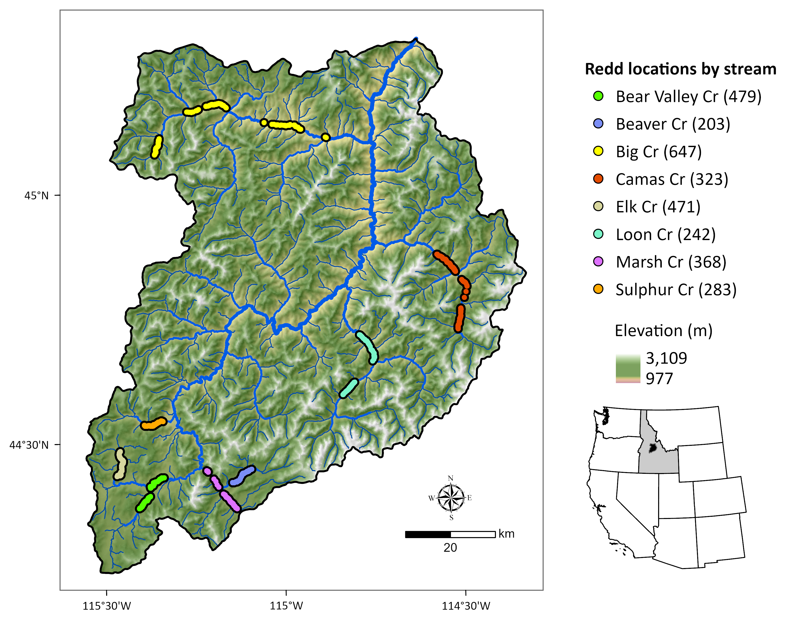

# Chinook salmon spawning phenology — Middle Fork Salmon River



This repository contains data and code supporting the manuscript:

> **Network-scale thermal and habitat heterogeneity structures a diverse Chinook salmon spawning portfolio**
> By: Bryan M. Maitland, Russ Thurow, Morgan Sparks, Dan Isaak, and John Buffington

Analysis of Chinook salmon spawning phenology in the Middle Fork Salmon River (MFSR), Idaho, USA, using georeferenced redd data (2002–2005) and modeled daily stream temperatures (Siegel et al. 2023).

---

## Project structure

```
mfsr_phenology/
│
├── data/
│   ├── raw/
│   │   └── russ_spawn/           # Original redd monitor XLS files + data notes
│   └── processed/
│       ├── russ_spawn/           # Cleaned and compiled redd CSV/RDS files
│       ├── siegel_temperature/   # Filtered Siegel et al. 2023 temperature data
│       └── gis/                  # Spatial layers (NHD flowlines, HUC8 boundaries)
│
├── R/
│   ├── 01_compile-spawn-data.R   # Compiles raw XLS redd files into combined dataset
│   ├── 02_clean-spawn-data.R     # Cleans and filters combined redd data
│   ├── 03_process-siegel-temps.R # Filters Siegel et al. 2023 data to MFSR COMIDs
│   ├── 04_comid-temperature.R    # Computes time-windowed temperature summaries per redd
│   ├── 05_flow-covariates.R      # Downloads and summarises USGS flow data
│   ├── utils.R                   # Helper functions (model comparison, tables, plotting)
│   ├── palettes-themes.R         # Color palettes and ggplot2 themes
│   └── archive/                  # Superseded or exploratory scripts (kept for reference)
│
├── analysis/
│   ├── _shared.R                 # Shared data loading — source this before running interactively
│   ├── _01_eda.qmd               # Fragment: Datasets + Exploratory Data Analysis
│   ├── _02_modeling.qmd          # Fragment: Model selection and diagnostics
│   └── _03_results.qmd           # Fragment: Final model results and interpretation
│
├── appendix/
│   └── appendix.qmd              # Published supplementary document (renders to PDF)
│
├── docs/
│   └── ms/                       # Manuscript versions (Word .docx files)
│
├── plots/                        # Final figures (PDF + PNG)
├── tables/                       # Final tables (CSV + DOCX)
└── mfsr_phenology.Rproj
```

---

## How to reproduce the analysis

### Prerequisites

- R ≥ 4.3
- [Quarto](https://quarto.org) ≥ 1.4
- Key R packages: `tidyverse`, `lme4`, `splines`, `easystats`, `DHARMa`, `ggeffects`, `kableExtra`, `patchwork`, `ggh4x`, `here`

### Step 1 — Run the data pipeline

These scripts must be run in order. Each produces one or more processed data files in `data/processed/`.

```r
source("R/01_compile-spawn-data.R")   # → data/processed/russ_spawn/mfsr_spawn_combined.*
source("R/02_clean-spawn-data.R")     # → data/processed/russ_spawn/mfsr_spawn_cleaned.csv
source("R/03_process-siegel-temps.R") # → data/processed/siegel_temperature/siegel_mfsr_comid.RDS
source("R/04_comid-temperature.R")    # → data/processed/comid_temps.RData
source("R/05_flow-covariates.R")      # → data/processed/mfsr_flow.csv, spawn_flows.csv
```

> **Note:** `R/03_process-siegel-temps.R` requires the full Siegel et al. (2023) temperature dataset, available at https://zenodo.org/records/8174951. Download and place it in a local directory, then update the path in that script.

### Step 2 — Render the supplementary appendix

From the project root:

```bash
quarto render appendix/appendix.qmd
```

This produces `appendix/appendix.pdf` — the published supplementary document.

### Step 3 — Interactive analysis

To explore or modify individual analysis sections in RStudio, open any `analysis/_0*.qmd` file and first run:

```r
source(here::here("analysis/_shared.R"))
```

This loads all data objects into your session. You can then run chunks in any of the three analysis fragments interactively.

---

## Data sources

| Dataset | Source | Location |
|---|---|---|
| Chinook salmon redd data | Russ Thurow, USDA Forest Service | `data/raw/russ_spawn/` |
| Modeled stream temperatures | Siegel et al. (2023), Zenodo | `data/processed/siegel_temperature/` |
| NHDPlus elevation and slope | Horizon Systems (2018) | `data/processed/elevslope.rds` |
| USGS streamflow | USGS Gage 13309220 (MF Lodge) | `data/processed/mfsr_flow.csv` |
| GIS layers | NHD, WBD | `data/processed/gis/` |

---

## Cross-referencing figures in the manuscript

Figures in the supplementary appendix are numbered with an "A" prefix (Figure A1, A2, …) controlled by the LaTeX counter commands in `analysis/_01_eda.qmd`. Reference them in the manuscript text as, e.g., "see Supplementary Material, Figure A2."

---
