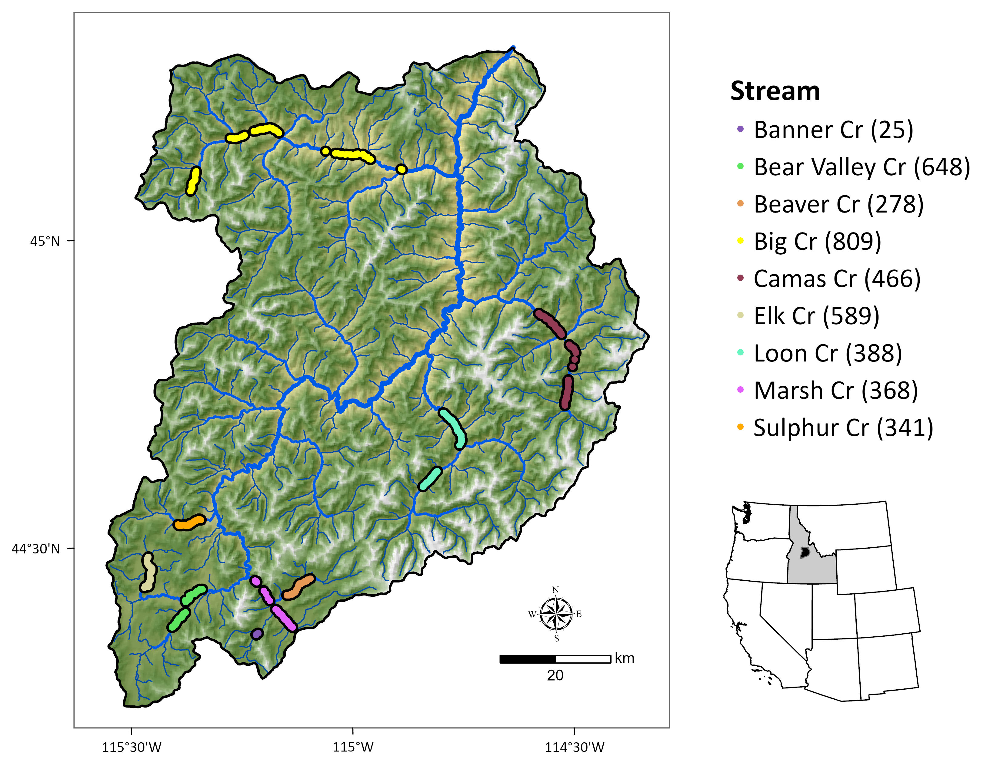

```{r setup, include=FALSE}
knitr::opts_chunk$set(echo = TRUE)
library(tidyverse)
library(here)
library(patchwork)
library(lme4)
library(mgcv)
library(gratia)
source(here("R", "gg_theme.R"))
library(MuMIn)
```

Goal: describe variation in spawn timing and how it related to environmental conditions.

## 1. Study Area and species

This study was conducted in the Middle Fork of the Salmon River (MFSR) in central Idaho (Fig. 1).



## 2. Data prep and inspection

### Spawn timing data

Spawn timing data for Chinook salmon were collected from 2001 to 2005 in the MFSR. We removed data from 2001, and data from Knapp Creek and Cape Horn Creek, as these sites were not consistently sampled. We consider the day of year a redd is assumed to be complete as our response variable (spawn timing). Each redd location was assigned a COMID based on the NHD, which is analogous to a stream reach. The COMID is used to link the spawn timing data with covariate data associated with the srtream reach on which it is located.

```{r load-spawn-data}
# Response data ---------------
spawn_data <- read_csv(here("data", "russ_spawn", "mfsr_spawn_cleaned.csv"))

# remove bad data
spawn_data <- spawn_data |>
  filter(stream != "Knapp" & stream != "Cape Horn" & year != 2001) |> 
  mutate(year = as.factor(year), stream = as.factor(stream), COMID = as.factor(COMID))

glimpse(spawn_data)
# length(unique(spawn_data$COMID))  # 104
# length(unique(spawn_data$stream))  # 8
# length(unique(spawn_data$year))  # 4
```

The data comprise `r nrow(spawn_data)` redd observation from `r length(unique(spawn_data$stream))` streams across `r length(unique(spawn_data$year))` years. The redds were observed between day `r min(spawn_data$yday)` and `r max(spawn_data$yday)`.

### Covariates

To test for environmental factors driving variation in spawn timing, we quantified associations with metrics describing thermal and physical conditions in stream reaches.

We selected covariates based on the following criteria: (1) they are known to influence spawn timing, (2) they are available for all streams, and (3) they are not highly correlated with each other.

Our focal independent variable were the average daily flow (cfs) and stream temperature (°C) during the 30, 60, and 90 days prior to spawning. We also included the slope of the stream reach and the mean elevation of the stream reach.

```{r load-covariates}
# Covariates --------------------------------------------------------------

flow_data <- read_csv(here("data", "spawn_flows.csv"))

comid_data <- readRDS(here("data", "elevslope.rds"))

load(here("data", "comid_temps.RData"))

# lgd_chinook <-tibble(year = c(2002,2003,2004,2005),
#                      spring_chinook = c(75025,70609,70742,26028),
#                      spring_jacks = c(2089,8295,4482,1258),
#                      all_chinook = c(109535, 98763, 94469, 43958)) |> 
#   mutate(year = as.factor(year))

# Combine data ------------------------------------------------------------

# temperature data and reshape
temp_data <- out |>
  filter(period == "before" & duration %in% c(30, 60, 90)) |>
  pivot_wider(
    names_from = "duration", 
    values_from = avg_temp, 
    names_prefix = "temp_"
    )

# commbine flow and spawn in combined data
combined_data <- spawn_data |>
  left_join(flow_data, join_by(date == spawn_date))

# add temperature data to combined data
combined_data <- combined_data |>
  left_join(temp_data, join_by(UNIQUE_ID == redd_id))

# add physical data to combined data and then filter
combined_data <- combined_data |>
  left_join(comid_data |> mutate(COMID = as.factor(COMID)), join_by(COMID)) |>
  mutate(
    mean_elevation = (MAXELEVSMO + MINELEVSMO) / 2 / 100,
    yday = yday(date)
  )

# # join with lgd data
# combined_data <- combined_data |>
#   left_join(lgd_chinook, join_by(year))

# make a df of just response and covariates
model_data <- combined_data |>
  filter(SLOPE < .2) |> # bad slope data
  select(
    yday, COMID, stream, year,
    flow_30, flow_60, flow_90,
    temp_30, temp_60, temp_90,
    SLOPE, mean_elevation
  )
```

## 3. Descriptive stats and visualizations

We evaluated variation in spawn timing using histograms, boxplots, density plots. We also calculated summary statistics for spawn timing.

### Spawn time variation

```{r plot-desc-spawn}
# historgram and density of spawn timing
p1 <- ggplot(spawn_data, aes(x = yday)) +
  geom_histogram(
    aes(y = after_stat(density)),
    bins = 30, fill = "gray70", color = "black") +
  geom_density(color = "black", size = 1.2) +
  geom_vline(
    aes(xintercept = mean(yday)),
    color = "black", linetype = "dashed", linewidth = 1.2) +
  annotate(
    "text", x = 260, y = .06, hjust = 1, vjust = 1, size = 4.5,
    label = paste0
    (
      "mean = ", round(mean(spawn_data$yday), 2), "\n",
      "median = ", round(median(spawn_data$yday), 2), "\n",
      "min = ", round(min(spawn_data$yday), 2), "\n",
      "max = ", round(max(spawn_data$yday), 2), "\n",
      "var = ", round(var(spawn_data$yday), 2), "\n",
      "SD = ", round(sd(spawn_data$yday), 2)
    )
  ) +
  labs(
    title = "Histogram and Density of Spawn Dates",
    x = "Spawn Date (DOY)",
    y = "Density"
  ) +
  theme_custom()

# plot spawn date by stream
p2 <- ggplot(spawn_data, aes(x = year, y = yday, color = stream)) +
  geom_boxplot() +
  # geom_jitter(aes(color = stream), size = 1.5, alpha = 0.5) +
  labs(
    title = "Spawn Date by Stream",
    x = "Stream",
    y = "Spawn Date (DOY)"
  ) +
  theme_custom() +
  theme(axis.text.x = element_text(angle = 45, hjust = 1))

# Plot spawn date by year
p3 <- ggplot(spawn_data, aes(x = year, y = yday)) +
  geom_boxplot() +
  geom_jitter(aes(color = year), size = 1.5, alpha = 0.5) +
  labs(
    title = "Spawn Date by Year",
    x = "Year",
    y = "Spawn Date (DOY)"
  ) +
  theme_custom() +
  theme(axis.text.x = element_text(angle = 45, hjust = 1))

# panel
p1 / (p2 + p3)
```

-   mean and median are equal, low SD
-   var \< mean (no overdispersion) data are right-skewed, lumpy/multimodal, and not symmetric at least
-   2 peaks some fish spawn later, some earlier, multiple groups likely different pops or environmental drivers
-   Poisson family is response is count of spawning events per day Gaussian if model density as continuous

### Spawn tim variation by stream

```{r plot-temp-dist-spawn}
mfsr_by_site <- spawn_data |>
  group_by(stream, yday)

mfsr_all <- spawn_data |>
  summarise(
    median = median(yday),
    percentile_95 = quantile(yday, probs = 0.95),
    percentile_5 = quantile(yday, probs = 0.05)
  )

p4 <- plot <- spawn_data |>
  mutate(across(year, as.character)) |>
  group_by(stream, year) |>
  ggplot() +
  # facet_wrap(~stream, scales = "free_y", ncol = 1) +
  lemon::facet_rep_wrap(~stream, scales = "free_y", ncol = 2) +
  geom_vline(
    xintercept = mfsr_all$median, 
    color = "blue", 
    linetype = "dashed") +
  geom_vline(
    xintercept = c(mfsr_all$percentile_95, mfsr_all$percentile_5), 
    color = "purple", 
    linetype = "dashed") +
  geom_density(aes(x = yday, y = after_stat(count), fill = year), alpha = 0.5) +
  geom_density(data = mfsr_by_site, aes(x = yday, after_stat(count)), alpha = 0, linetype = "dashed") +
  scale_fill_brewer(palette = "Dark2", name = "Year") +
  labs(x = "Spawn Day of Year", y = "Count of redds") +
  theme_custom()
p4
```

### Cumulative proportions of redds by stream

```{r plot-cum-props}
# Proportional cumulative redds ------------------------------------------------
# spawn_data %>%
#   group_by(stream, yday) %>%
#   tally() %>%
#   group_by(stream) %>%
#   arrange(yday) %>%
#   mutate(cumulative = cumsum(n)) %>%
#   ggplot(aes(x = yday, y = cumulative, color = stream)) +
#   geom_line() +
#   labs(title = "Cumulative Redd Counts", y = "Cumulative Redds") +
#   theme_custom()


# Proportional cumulative redds by stream --------------------------------------
# For each year and stream, calculate the prop. cumulative number of redds
props <- spawn_data |> 
  select(year, stream, yday) |>
  group_by(year, stream, yday) |>
  add_count() |> 
  distinct() |> 
  group_by(year, stream) |>
  arrange(year, stream, yday) |>
  mutate(cum_redds = cumsum(n)) |> 
  mutate(cum_redds_p = cum_redds / max(cum_redds))

# Plot pro. cumsums
p5 <- props |> 
  ggplot(aes(x = yday, y = cum_redds_p, color = as.factor(year))) +
  lemon::facet_rep_wrap(~stream, ncol = 2, scales = "free_y") +
  geom_line(linewidth = 0.5) + 
  geom_point(size = 0.3) + 
  theme_custom() + 
  scale_color_brewer(palette = "Dark2") + 
  labs(
    x = "Day of Year",
    y = "Proportional Cumulative Redds",
    color = ""
  )
p5
```


## 4. Bivariate relationships with covariates

```{r plot-covars}
plot_covariate <- function(data, covariate) {
  ggplot(data, aes_string(x = covariate, y = "yday")) +
    geom_point() +
    geom_smooth() +
    labs(x = covariate, y = "DOY") +
    theme_custom()
}
covariates <- c("temp_30", "flow_30", "temp_60", "flow_60", "temp_90", "flow_90", "SLOPE", "mean_elevation")
plots <- map(covariates, ~ plot_covariate(model_data, .x))
gridExtra::grid.arrange(grobs = plots, ncol = 2)
```

-   temp_30 = no relationship, drop
-   temp_60 = good non-linear, drop for temp_90
-   temp_90 = better non-linear
-   flow_30 and flow_60 = similar decaying exponential
-   flow_90 = inflections, interesting grouping really spreads out, year effect
-   SLOPE = no relationship, dropping
-   mean_elevation = slightly negative linear?

## 5. Check for colinearity

```{r plot-colinearity}
model_data |> 
  select(temp_30, temp_60, temp_90, flow_30, flow_60, flow_90, mean_elevation) |> 
  GGally::ggpairs()
```

-   There is strong colinearity among temp variable. Retaining temp_90 as it has the strongest relationship.
-   flow_30 and flow_60 are highly correlated with flow_90. We will keep flow_90 as it has the strongest relationship.
-   elevation good to keep

```{r vifs}
car::vif(lm(yday ~ flow_30 + flow_60 + flow_90 + temp_90 + mean_elevation + stream + year, data = model_data))
car::vif(lm(yday ~ flow_90 + temp_90 + mean_elevation + stream + year, data = model_data))
```

-   more reason to drop flow 30 and 90

## 6. Closer look at covariates

### Temp_90

```{r}
(ggplot(model_data, aes(x = temp_90, y = yday, color = year)) +
  geom_point() +
  geom_smooth(method = "lm") +
  theme_classic()) +

(ggplot(model_data, aes(x = temp_90, y = yday, color = stream)) +
  geom_point() +
  geom_smooth(method = "lm") +
  theme_classic()) + 
  plot_annotation(title = "Spawn Timing vs. 90-day mean temperature pre spawn")
```

-   clear positive relationship, certainly some non-linearity
-   stream- and year-level variation (interactions)

Check simple models for temp to examine functional structure:

```{r}
# compare linear, quadriatic, and gam model
m1 <- lm(yday ~ temp_90, data = model_data)
m2 <- lm(yday ~ poly(temp_90, 2), data = model_data)
m3 <- gam(yday ~ s(temp_90, k = 5), data = model_data, method = "ML")

AIC(m1, m2, m3) |> 
  arrange(AIC) |> 
  kableExtra::kbl() |> 
  kableExtra::kable_styling("striped", full_width = F) |> 
  kableExtra::add_header_above(c(" " = 1, "AIC" = 2))

sjPlot::tab_model(m1, m2, m3)

model_data |> 
  ggplot(aes(x = temp_90, y = yday)) +
  geom_point(alpha = 0.3) +
  geom_smooth(method = "lm", formula = y ~ x, se = FALSE, color = "blue") +
  geom_smooth(method = "lm", formula = y ~ poly(x, 2), se = FALSE, color = "green") +
  geom_smooth(method = "gam", formula = y ~ s(x, k = 5), method.args = list(method = "REML"), se = FALSE, color = "red") +
  theme_custom()
```

-   linear model is bad, quadratic is better, but GAM is best based on AIC
-   GAM is likely overfitting, but the quadratic model is not flexible enough to capture the non-linearity
-   interactions with stream may account for some of the non-linearity

### Flow_90

```{r}
(ggplot(model_data, aes(x = flow_90, y = yday, color = year)) +
  geom_point() +
  geom_smooth(method = "lm") +
  theme_classic()) +

(ggplot(model_data, aes(x = flow_90, y = yday, color = stream)) +
  geom_point() +
  geom_smooth(method = "lm") +
  theme_classic())
```

-   clear negative relationship, higher 90-day mean flows are associated with earlier spawn timing
-   relationship differs by year: 2003 linear but flattening or non-linear at higher flows
-   suggest different slopes or curves across years (year specific responses, but just intercepts)
-   stream-level variation as well, different intercepts and slopes
-   this is really a year effect with variation by stream and comid (local)

Check simple models for flow to examine functional structure:

```{r}
# compare linear, quadriatic, and gam model
m1 <- lm(yday ~ flow_90, data = model_data)
m2 <- lm(yday ~ flow_90 * year, data = model_data)
m3 <- lm(yday ~ flow_90 * year + poly(flow_90, 2), data = model_data)
m4 <- lm(yday ~ poly(flow_90, 2), data = model_data)
m5 <- gam(yday ~ s(flow_90, k = 5), data = model_data, method = "REML")
m6 <- gam(yday ~ s(flow_90, by = year, k = 5), data = model_data, method = "REML")

AIC(m1, m2, m3, m4, m5, m6) |> 
  arrange(AIC) |> 
  kableExtra::kbl() |> 
  kableExtra::kable_styling("striped", full_width = F) |> 
  kableExtra::add_header_above(c(" " = 1, "AIC" = 2))

# sjPlot::tab_model(m1, m2, m3, m4, m5, m6)
# summary(m2)

# prediction grid
pred_data <- model_data %>%
  group_by(year) %>%
  summarize(min_flow = min(flow_90), max_flow = max(flow_90)) %>%
  rowwise() %>%
  do(data.frame(year = .$year,
                flow_90 = seq(.$min_flow, .$max_flow, length.out = 100))) %>%
  ungroup()

# Predict
pred_data$yday_pred_m2 <- predict(m2, newdata = pred_data)
pred_data$yday_pred_m3 <- predict(m3, newdata = pred_data)
pred_data$yday_pred_m6 <- predict(m6, newdata = pred_data)

# # Plot with original points
ggplot(model_data, aes(x = flow_90, y = yday, color = year)) +
  geom_point(alpha = 0.3) +
  geom_line(data = pred_data, aes(x = flow_90, y = yday_pred_m2, color = year), size = 1.2) +
  labs(title = "GAM Fit by Year", y = "Day of Year", x = "Flow (90-day mean)")

model_data |> 
  ggplot(aes(x = flow_90, y = yday, color = year)) +
  geom_point(alpha = 0.3) +
  # geom_smooth(method = "lm", formula = y ~ x, se = FALSE, color = "grey1") +
  # geom_smooth(method = "lm", formula = y ~ poly(x, 2), se = FALSE, color = "grey50") +
  # geom_smooth(method = "gam", formula = y ~ s(x, k = 5), method.args = list(method = "REML"), se = FALSE, color = "grey90") +
  # geom_line(data = pred_data, aes(x = flow_90, y = yday_pred_m2), size = 1.2) +
  geom_line(data = pred_data, aes(x = flow_90, y = yday_pred_m3), size = 1.2) +
  # geom_line(data = pred_data, aes(x = flow_90, y = yday_pred_m6), size = 1.2) +
  theme_custom()
```

-   linear model is bad, quadratic is better, but GAM is best based on AIC
-   GAM is defintely overfitting becuase each year has a narrow flow range, only 2003 has high flows
-   poly fit with year intereaction is best non-GAM fit, but still probably overfitted

#### To include or not to include flow_90?

Including flow_90 could indeed be introducing spurious precision and possibly overfitting your model. Let’s walk through the reasons why.

Why flow_90 might be problematic:

1. Not spatially resolved

-   We are modeling spawn timing at the redd level (COMID/stream)
-   But flow_90 is calculated from a single downstream gauge, and applied to all redds
-   This assumes flow conditions are identical across all sites, which is rarely true in a branching stream network

→ Including it gives the illusion of spatially resolved variation that isn’t there

2. Likely correlated with year

-   Since flow_90 varies mostly across years, (albeit slightly with streams), it is strongly confounded with year
-   Any flow-related signal is probably already captured by your year fixed effect

→ Including both flow_90 and year risks collinearity, and may produce misleading inferences

3. Spawn-time aligned flow ≠ experienced flow

-   While flow_90 is aligned to each redd’s spawn date, it still reflects a lower-basin gauge, not the actual hydrologic conditions experienced at the redd site

→ So it might be precisely wrong — aligned in time but irrelevant in space

Bottom Line: Unless we have site-specific or spatially disaggregated flow data, flow_90 is probably not a valid covariate for redd-level models.

Including it may:

-   Overfit due to noise or pseudo-replication
-   Complicate interpretation (e.g., why one stream "responds" to flows measured elsewhere?)
-   Mask true year or site effects

Recommendation: Drop flow_90 from model (or at most, keep it as a year-level covariate if you summarize it to a single annual value for all observations)

Although we initially considered including 90-day mean streamflow (flow_90) as a predictor of spawn timing, this variable was ultimately excluded due to concerns about ecological validity and model overfitting. Streamflow data were derived from a single downstream USGS gauge and did not capture spatial variation across the study streams or reaches. Moreover, because flow_90 was closely aligned with year, it introduced strong collinearity with the year effect and risked attributing site-level variation to flow patterns not actually experienced by individual redds. As such, we excluded flow_90 to avoid misleading inference.

## 7. Scale and final dataset

Final dataset includes:

-   response: spawn time (doy), continuous
-   grouping variables: comid, stream, year (but not using COMID due to sparse data)
-   temp_90, flow_90, elevation

```{r}
# select variables and standardize continuous covariates
scale2 <- function(x, na.rm = FALSE) (x - mean(x, na.rm = na.rm)) / sd(x, na.rm)

# model_data_final <- model_data |>
#   select(yday, COMID, stream, year, temp_90, mean_elevation) 

model_data_final <- model_data |>
  select(yday, COMID, stream, year, temp_90, mean_elevation) |>
  mutate(across(c("temp_90", "mean_elevation"), scale2))
```

## 8. Model specification

### Overfitting

When we first started, we used models with renefs, but were observing classic overfitting. Here’s what’s likely going wrong with the mixed-effects model:

Symptom | Cause
High AIC-based model performance but stream-level predictions far from observed data | Random effects absorbing noise or overfitting sparse groups
Random intercepts for COMID dominate variance | Many COMIDs have only 1 observation → intercepts become noise
Unequal data across years and streams | Random intercepts get misled by imbalance, especially for sparse years (like 2005)
Random slopes and interactions fail to improve fit | Not enough data per group to support slope variation

A simple lm may be better here because it treats stream and year as explicit, estimable fixed effects, which gives you real, interpretable estimates for group means. It doesn’t try to “guess” partial-pooling intercepts or slopes where data are lacking. The model becomes transparent — predictions reflect what’s in the data, not what the model infers from structure.

Use lmer() only when:

-   You have multiple observations per group
-   You care about generalizing across groups (e.g., many streams or many years)
-   You're interested in variance components, not just means

But when:

-   Group sizes are small or imbalanced
-   Predictions need to match observed group means
-   You want direct comparisons (e.g., “stream A is 10 days later than stream B”)

→ Then a fixed-effect linear model is the better choice.

### Fixed and random effects

Only include a grouping variable as both fixef and ranef when you want to model differenct aspects of the effect. E.g., stream as fixed to compared average effects by stream, but as ranefs to account for non-independence of obs within each stream but not to compare average effects. Include as both when you want population-level estimates AND when you expect stream-level random variation around those means. Do not include both when intercepts are redundant (\~ stream + (1\| stream)), or too few levels for the random effect to be estimated (e.g., \<5 levels).

| Variable | Fixed? | Random? | Why |
|------------------|------------------|------------------|------------------|
| COMID | No | Yes | Not estimating individual COMID effects, just accounting for correlation. |
| Stream | Yes | Maybe (only if random slope or complex structure) | May want to estimate differences and account for grouping. |
| Year | Yes (comparing years) | Maybe (account for inter-annual variability) | Use one or the other depending on goal. |

In this case, it makes sense to include year as fixed because:

-   only has 4 levels - so a ranef would estimate variance poorly and shrink aggressively
-   year captures unmeasured inter annual variability (snow pack, flow, temp anomalies all wrapped in)
-   we want to compare among years given we only have 4 years of data, hard to extrapolate

Let's examine the grouping strcture within the data to make a final decision. 

### Grouping structure of data

##### Stream and COMID

```{r}
# number of comids per stream
spawn_data |> 
  distinct(stream, COMID) |> 
  count(stream, name = "n_COMIDs") |> 
  arrange(desc(n_COMIDs)) |> 
  kableExtra::kbl(caption = "Number of comids per stream") |>
  kableExtra::kable_styling("striped", full_width = FALSE) 

# How many COMIDs have <5 observations?
n_sparse_COMIDS_5 <- spawn_data |> 
  count(COMID, name = "n_redds") |> 
  filter(n_redds < 5) |> 
  nrow()
n_sparse_COMIDS_2 <- spawn_data |> 
  count(COMID, name = "n_redds") |> 
  filter(n_redds <= 2) |> 
  nrow()

# what percent of comids have <= 1 obervation?
# spawn_data |> 
#   count(COMID, name = "n_redds") |> 
#   filter(n_redds <= 1) |> 
#   nrow() / length(unique(spawn_data$COMID)) * 100
# 
# spawn_data |> 
#   count(COMID, name = "n_redds") |> 
#   filter(n_redds <= 2) |> 
#   nrow() / length(unique(spawn_data$COMID)) * 100
# 
# spawn_data |> 
#   count(COMID, name = "n_redds") |> 
#   filter(n_redds <= 5) |> 
#   nrow() / length(unique(spawn_data$COMID)) * 100

# number of observations per COMID
spawn_data |> 
  count(COMID, name = "n_redds") |> 
  arrange(n_redds) |> 
  ggplot(aes(n_redds)) +
  geom_bar() + 
  scale_y_continuous(breaks = seq(0,10,1)) + 
  labs(title = "Number of obervations (redds) per COMID") + 
  theme_custom()
```

There are at least 6 COMIDs per stream, and the number of observations per COMID is highly variable. The histogram shows that most COMIDs have 1-2 observations, but some have many more. `r n_sparse_COMIDS_5` COMIDs have fewer than 5 observations.

##### Year stream, and COMID

```{r}
# COMIDs per stream-year combo
spawn_data |> 
  distinct(year, stream, COMID) |> 
  count(stream, year, name = "n_COMIDs") |> 
  arrange(stream, year) |> 
  pivot_wider(
    names_from = year, 
    values_from = n_COMIDs,
    values_fill = 0
  ) |> 
  kableExtra::kbl(caption = "COMIDs per stream-year combo") |>
  kableExtra::kable_styling("striped", full_width = F) 
```

There is at least 2 COMIDs for every stream-year combination. 

```{r}
# Number of redds per COMID-year combo
spawn_data |> 
  count(COMID, year, name = "n_redds") |> 
  arrange(n_redds)  |> 
  ggplot(aes(n_redds)) +
  facet_wrap(~year) + 
  geom_bar() + 
  labs(title = "Number of obervations (redds) per COMID")
```

This shows that many COMID-year combinations have only one redd. 

##### Table of redd counts by stream and year

```{r}
spawn_data |> 
  count(stream, year, name = "n_redds") |> 
  pivot_wider(
    names_from = year, 
    values_from = n_redds,
    values_fill = 0
  )
```

No data are available for Big Creek or Sulpher Creek in 2005.

##### Summary

Are the enough COMIDs per stream to consider stream/COMID nested random effects? No. 

Are groups well sampled? (Do most COMIDs have >1-2 redds?) No. 23 COMIDs have <5 redds (25%), 13 have <= 2. (12.5%) With <5 obs/level, variance estimates become unstable -> overfit and absorb noise (low AIC / high R2) -> singular fits. 

Are year or stream-level random effects justifiable? We want to compare streams and years in this dataset, not generalize beyond them, so we should use fixed effects. Further, stream are known, of interest, and were not randomly sampled. Including (1 | stream) would be statistically redundant (stream intercepts would be double-modeled) and would lead to misleading AIC comparisons. 

Random slopes?. The needs multiple obs per group across a range of slope variable (temp_90), enough replication to estimate variation in slopes, not just intercepts. Need ~8+ obs per group spread across the covariate. We could do this for stream or year. Prob not. 

So, we should use a simple linear model with no random effects. This allows for interpretable results, no overfitting from random effects, and is a reasonable approach given the design. 

If we did try (1 | COMID), expect singularity, low variance estimates for COMID, and predictions will likley miss the groups means. 


## 9. Model fitting and comparison

### Final candidate covariates and interactions

-   temp_90: 90-day mean temperature
-   mean_elevation: mean elevation of the stream reach
-   stream: stream name
-   year: year of observation

| Interaction               | Description                                                        | Possible Interpretation                                                                   |
|---------------------------|--------------------------------------------------------------------|-------------------------------------------------------------------------------------------|
| `temp_90 × stream`        | Temperature effects on spawn timing vary across streams            | Some streams may be more thermally sensitive (e.g., due to groundwater, shading, etc.)    |
| `temp_90 × year`          | Interannual differences in how temperature affects spawn timing    | Annual climate conditions (e.g., snowmelt timing, baseflow) modify temp-timing response   |
| `stream × year`           | Stream-specific interannual variation                              | Some streams respond more strongly to wet/dry or hot/cool years                           |
| `mean_elevation × stream` | Elevation effects on timing vary by stream                         | Elevation proxies snowpack or gradient, which may matter differently by stream            |
| `mean_elevation × year`   | Elevation effects change across years                              | Snowmelt timing shifts may be more impactful in some years                                |
| `temp_90 × mean_elevation`| Thermal effects depend on elevation                                | High-elevation streams may respond more strongly or weakly to the same temp range         |

The most plausible core interactions to include a prior are:
-   `temp_90 × stream`
-   `temp_90 × year`

Others like `stream x year` are data hungry and may overfit without strong replication. 
Iteractions with `mean_elevation` does not make much sense (and way overfits, vertical offsets). 

### Simple LM


First we'll fit simple linear models to get a sense of the data and the relationships. Adding new interactions each time. 

```{r}
m1 <- lm(yday ~ temp_90 + mean_elevation + stream + year, data = model_data_final)
m1 <- lm(yday ~ temp_90 + mean_elevation + stream + year, data = model_data_final)
m2 <- lm(yday ~ temp_90 * stream + temp_90 + mean_elevation + stream + year, data = model_data_final)
m3 <- lm(yday ~ temp_90 * stream + temp_90 * year + temp_90 + mean_elevation + stream + year, data = model_data_final)
m4 <- lm(yday ~ temp_90 * stream + temp_90 * year + stream * year + temp_90 + mean_elevation + stream + year, data = model_data_final)
AIC(m1, m2, m3, m4) |> 
  arrange(AIC) |> 
  # calulate delta aic
  mutate(delta = AIC - min(AIC)) 

pred_stream_temp <- ggeffects::ggpredict(m4, terms = c("temp_90", "year"))

ggplot(pred_stream_temp, aes(x = x, y = predicted, color = group)) +
  geom_line(size = 1.1) +
  geom_ribbon(aes(ymin = conf.low, ymax = conf.high, fill = group), alpha = 0.2, color = NA) +
  geom_point(data = model_data_final, aes(x = temp_90, y = yday, color = year)) +
  labs(title = "Stream-Specific Predicted vs Observed Spawn Timing",
       x = "90-day Mean Temp", y = "Spawn Day of Year", color = "Stream", fill = "Stream") +
  theme_custom() +
  theme(legend.position = "right")
```

Full interaction (m4) is best. We will now compare all possible combinations of the interactions, expect with elevation. 

```{r}
global_model <- lm(yday ~ temp_90 * stream + temp_90 * year + stream * year + temp_90 + mean_elevation + stream + year, data = model_data_final)

# Run dredge
library(MuMIn)
options(na.action = "na.fail")  # Required for dredge
model_set <- dredge(global_model, trace = 1, rank = "AIC")

head(model_set)           # View top models
# summary(model_set)        # Summary of terms retained
# get.models(model_set, 1)  # Extract top model
```

Model 128 with all 2-way interactions is the best supported model based on AIC. It is overwhelmingly th best fit to the data using linear temp. That tell us the predictors are capturing substaintial structure, and the interactions are highly informative. 

Look at diagnostics and predictions. 

```{r}
subset(model_set, delta < 2)
final_model <- get.models(model_set, 1)[[1]]

# summary(final_model)
# par(mfrow=c(2,2))
# plot(final_model)
# par(mfrow=c(1,1))

pred_stream_temp <- ggeffects::ggpredict(final_model, terms = c("temp_90", "stream"))

ggplot(pred_stream_temp, aes(x = x, y = predicted, color = group)) +
  geom_line(size = 1.1) +
  geom_ribbon(aes(ymin = conf.low, ymax = conf.high, fill = group), alpha = 0.2, color = NA) +
  geom_point(data = model_data_final, aes(x = temp_90, y = yday, color = stream)) +
  labs(title = "Stream-Specific Predicted vs Observed Spawn Timing",
       x = "90-day Mean Temp", y = "Spawn Day of Year", color = "Stream", fill = "Stream") +
  theme_custom() +
  theme(legend.position = "right") +
  scale_color_manual(values = c("#E41A1C", "#377EB8", "#4DAF4A", "#FF7F00", "#FFFF33", "#A65628", "#999999", "#F781BF")) + 
  scale_fill_manual(values = c("#E41A1C", "#377EB8", "#4DAF4A", "#FF7F00", "#FFFF33", "#A65628", "#999999", "#F781BF")) 

pred_stream_temp <- ggeffects::ggpredict(final_model, terms = c("temp_90", "year"))

ggplot(pred_stream_temp, aes(x = x, y = predicted, color = group)) +
  geom_line(size = 1.1) +
  geom_ribbon(aes(ymin = conf.low, ymax = conf.high, fill = group), alpha = 0.2, color = NA) +
  geom_point(data = model_data_final, aes(x = temp_90, y = yday, color = year)) +
  labs(title = "Stream-Specific Predicted vs Observed Spawn Timing",
       x = "90-day Mean Temp", y = "Spawn Day of Year", color = "Stream", fill = "Stream") +
  theme_custom() +
  theme(legend.position = "right") +
  scale_color_manual(values = c("#E41A1C", "#377EB8", "#4DAF4A", "#FF7F00", "#FFFF33", "#A65628", "#999999", "#F781BF")) + 
  scale_fill_manual(values = c("#E41A1C", "#377EB8", "#4DAF4A", "#FF7F00", "#FFFF33", "#A65628", "#999999", "#F781BF")) 
```

-   Some stream-specific fits still underperform, especially at extremes
-   Year-specific predictions are systematically low (in both linear and poly models)
-   The orthogonal poly(temp_90, 2) didn't resolve this and may be too constrained
-   Raw quadratic (I(temp_90^2)) might help fine-tune curvature per stream or year

Next we will fit a new best + quadratic model. 

```{r}
lm_poly <- lm(yday ~ temp_90 * stream + temp_90 * year + stream * year + I(temp_90^2) + mean_elevation + stream + year,data = model_data_final)
AIC(final_model, lm_poly) |> arrange(AIC) |> mutate(delta = AIC - min(AIC))
# summary(lm_poly)
```

The poly model improves AIC by ~400, major improvement. So the curvature is helping. 

```{r}
pred_stream_temp <- ggeffects::ggpredict(lm_poly, terms = c("temp_90", "year"))

ggplot(pred_stream_temp, aes(x = x, y = predicted, color = group)) +
  geom_line(size = 1.1) +
  geom_ribbon(aes(ymin = conf.low, ymax = conf.high, fill = group), alpha = 0.2, color = NA) +
  geom_point(data = model_data_final, aes(x = temp_90, y = yday, color = year)) +
  labs(title = "Stream-Specific Predicted vs Observed Spawn Timing",
       x = "90-day Mean Temp", y = "Spawn Day of Year", color = "Stream", fill = "Stream") +
  theme_custom() +
  theme(legend.position = "right") +
  # beter color sclae for 8 colors
  scale_color_manual(values = c("#E41A1C", "#377EB8", "#4DAF4A", "#FF7F00", "#FFFF33", "#A65628", "#999999", "#F781BF")) + 
  scale_fill_manual(values = c("#E41A1C", "#377EB8", "#4DAF4A", "#FF7F00", "#FFFF33", "#A65628", "#999999", "#F781BF")) 
```

We used AIC-based model selection to identify the best-supported linear model that included temp_90, mean_elevation, stream, year, and all two-way interactions. This model outperformed all simpler alternatives by a large AIC margin. We then tested an alternative model including a raw quadratic term (I(temp_90^2)) to account for potential nonlinearity in the temperature–spawn timing relationship. Model performance was evaluated using AIC and visual assessment of stream- and year-specific predictions.


```{r}
# Linear model predictions
pred_linear <- ggeffects::ggpredict(final_model, terms = c("temp_90", "stream"))

# Quadratic model predictions
pred_quad <- ggeffects::ggpredict(lm_poly, terms = c("temp_90", "stream"))


# Combine predictions
pred_linear$model <- "Linear"
pred_quad$model <- "Quadratic"
pred_combined <- rbind(pred_linear, pred_quad)

# Merge stream colors from observed data if needed
ggplot() +
  geom_point(data = model_data_final, aes(x = temp_90, y = yday, color = stream), alpha = 0.3) +
  geom_line(data = pred_combined, aes(x = x, y = predicted, color = group, linetype = model), size = 1.1) +
  facet_wrap(~group) +
  labs(title = "Stream-Specific Predicted vs Observed Spawn Timing",
       subtitle = "Comparing Linear and Quadratic Models",
       x = "90-day Mean Temp", y = "Spawn Day of Year",
       color = "Stream", linetype = "Model") +
  theme_custom()

```

- Dashed vs solid lines show differences between models
- Improved fit near the tails or mid-range = quadratic model success
- Watch for overfitting or odd curvature in the quad model

### Model fit comparison

```{r}
# get preds for each model
model_data_final$pred_linear <- predict(final_model, newdata = model_data_final)
model_data_final$pred_quad   <- predict(lm_poly, newdata = model_data_final)

# compute error metrics by stream and year
model_error_summary <- model_data_final %>%
  mutate(error_linear = abs(yday - pred_linear),
         error_quad   = abs(yday - pred_quad)) %>%
  group_by(stream, year) %>%
  summarize(
    n = n(),
    MAE_linear = mean(error_linear),
    MAE_quad   = mean(error_quad),
    RMSE_linear = sqrt(mean((yday - pred_linear)^2)),
    RMSE_quad   = sqrt(mean((yday - pred_quad)^2)),
    .groups = "drop"
  )

# Long format
model_error_long <- model_error_summary %>%
  pivot_longer(cols = starts_with("RMSE"), names_to = "model", values_to = "RMSE") %>%
  mutate(model = ifelse(model == "RMSE_linear", "Linear", "Quadratic"))

# Stream level RMSE comparison
ggplot(model_error_long, aes(x = stream, y = RMSE, fill = model)) +
  geom_col(position = "dodge") +
  labs(title = "Model RMSE by Stream",
       y = "Root Mean Squared Error",
       x = "Stream") +
  theme_minimal()

# RMSE difference
model_error_summary %>%
  mutate(delta_RMSE = RMSE_linear - RMSE_quad) %>%
  ggplot(aes(x = reorder(stream, delta_RMSE), y = delta_RMSE, fill = delta_RMSE > 0)) +
  geom_col(show.legend = FALSE) +
  geom_hline(yintercept = 0, linetype = "dashed") +
  labs(title = "ΔRMSE by Stream (Linear - Quadratic)",
       x = "Stream", y = "RMSE Improvement from Quadratic", 
       subtitle = "(+) quadratic is better, (-) linear is better") +
  scale_fill_manual(values = c("firebrick", "steelblue")) +
  theme_minimal()
```


```{r}
model_error_summary <- model_data_final %>%
  mutate(error_linear = abs(yday - pred_linear),
         error_quad   = abs(yday - pred_quad)) %>%
  group_by(stream, year) %>%
  summarize(
    n = n(),
    RMSE_linear = sqrt(mean((yday - pred_linear)^2)),
    RMSE_quad   = sqrt(mean((yday - pred_quad)^2)),
    .groups = "drop"
  ) %>%
  mutate(delta_RMSE = RMSE_linear - RMSE_quad)  # positive = quad is better

# ggplot(model_error_summary, aes(x = year, y = delta_RMSE, fill = delta_RMSE > 0)) +
#   geom_col(position = "dodge") +
#   facet_wrap(~stream) +
#   geom_hline(yintercept = 0, linetype = "dashed") +
#   scale_fill_manual(values = c("firebrick", "steelblue")) +
#   labs(
#     title = "ΔRMSE by Stream and Year (Linear – Quadratic)",
#     subtitle = "Positive values indicate quadratic model fit better",
#     x = "Year", y = "RMSE Improvement from Quadratic"
#   ) +
#   theme_minimal() +
#   theme(legend.position = "none")

ggplot(model_error_summary, aes(x = year, y = delta_RMSE, fill = delta_RMSE > 0)) +
  geom_col(aes(alpha = n), position = "dodge") +
  facet_wrap(~stream) +
  scale_alpha(range = c(0.4, 1)) +
  scale_fill_manual(values = c("firebrick", "steelblue")) +
  geom_hline(yintercept = 0, linetype = "dashed") +
  labs(title = "ΔRMSE by Stream and Year", x = "Year", y = "RMSE: Linear – Quadratic", subtitle = "Alpha scaled to sample size") +
  theme_minimal() +
  theme(legend.position = "none")

```

-   facets show stream-level RMSE differences
-   patterns across years may highlight where curvature helps (e.g., early, warm, or dry years)

### Final plots

```{r}
# Panel A: Predicted Spawn Timing by Stream (Linear vs Quadratic)
pred_linear <- ggpredict(final_model, terms = c("temp_90", "stream"))
pred_quad   <- ggpredict(lm_poly, terms = c("temp_90", "stream"))

pred_linear$model <- "Linear"
pred_quad$model   <- "Quadratic"

pred_both <- rbind(pred_linear, pred_quad)

p9 <- ggplot() +
  geom_point(data = model_data_final, aes(x = temp_90, y = yday, color = stream), alpha = 0.3) +
  geom_line(data = pred_both, aes(x = x, y = predicted, color = group, linetype = model), size = 1.1) +
  facet_wrap(~group) +
  labs(title = "A) Predicted Spawn Timing by Stream",
       x = "90-day Mean Temp", y = "Spawn Day of Year") +
  theme_minimal() +
  theme(legend.position = "none")


# Panel B: ΔRMSE by Stream × Year
p10 <- ggplot(model_error_summary, aes(x = year, y = delta_RMSE, fill = delta_RMSE > 0)) +
  geom_col(position = "dodge") +
  facet_wrap(~stream) +
  geom_hline(yintercept = 0, linetype = "dashed") +
  scale_fill_manual(values = c("firebrick", "steelblue")) +
  labs(title = "B) Improvement from Quadratic Model (ΔRMSE)",
       x = "Year", y = "RMSE: Linear – Quadratic") +
  theme_minimal() +
  theme(legend.position = "none")

final_fig <- p1 / p2 + plot_layout(heights = c(1, 1))
final_fig
```

Panel A: Predicted vs. Observed Spawn Timing by Stream
This panel shows observed data points colored by year, overlaid with predicted lines for:

-   Linear model (dashed)
-   Quadratic model (solid)

Observations:
-   Big, Camas, Loon: The quadratic model (solid line) clearly improves fit at both ends of the temperature gradient, especially for Big, where the linear fit undershoots mid- and high-temperature values.
-   Beaver, Elk: Minor improvement; fits are similar, suggesting less curvature in the temp–spawn relationship.
-   Bear Valley and Sulphur: Some evidence of overprediction at low temps by the linear model; quadratic smooths that out.
-   Marsh: Very little difference — both models fit similarly well.

Interpretation:

The quadratic model improves predictions in streams where the spawn timing–temperature relationship is nonlinear, especially Big, Camas, and Loon. In other streams, where relationships appear more linear, the benefit is smaller.

Panel B: RMSE Difference (Linear – Quadratic) by Stream × Year
This shows whether the quadratic model improves RMSE per stream and year:

-   Blue bars (positive) = quadratic model fits better
-   Red bars (negative) = linear model fits better

Observations:
-   Big & Camas: Strong improvement from the quadratic model in nearly all years
-   Loon: Consistent benefit across years
-   Marsh, Sulphur, Elk: Mixed or minor advantage — some years favor linear
-   Beaver & Bear Valley: Slight benefit in most years, but not dramatic
-   2005: Generally weaker performance (as expected due to lower sample size)

Interpretation:

The quadratic model provides most benefit in streams with greater variability or nonlinearity in thermal exposure, particularly Big and Camas. In more stable or linearly responding systems (e.g., Marsh, Elk), the simpler linear model performs comparably. Interannual variation (e.g., 2005) may limit the gain from added complexity.

Stream-specific comparisons of observed and predicted spawn timing showed that a quadratic temperature model improved fit for several streams, particularly Big, Camas, and Loon (Figure A). In these cases, the relationship between temperature and spawn timing appeared nonlinear, with either plateauing or steepening at the warm and cold ends of the gradient. A comparison of model root mean squared error (RMSE) across stream-year combinations confirmed that the quadratic model provided lower prediction error in most streams and years, with the largest gains observed in Big Creek and Camas Creek (Figure B). In contrast, several streams (e.g., Marsh, Elk, and Sulphur) showed little to no improvement, suggesting a more linear response in those systems.


```{r}
tmp <- emmeans::emmeans(lm_poly, ~ stream | year) |> 
  as.data.frame() |> 
  mutate(year = as.character(year)) |> 
  ggplot(aes(x = year, y = emmean, color = stream)) +
  geom_point() +
  geom_line(aes(group = stream), size = 1.2) +
  # geom_errorbar(aes(ymin = lower.CL, ymax = upper.CL), width = 0.2) +
  labs(title = "Estimated Marginal Means of Spawn Timing by Stream and Year",
       x = "Year", y = "Spawn Day of Year", color = "Stream") +
  theme_custom() + 
  theme(legend.position = "right") +
  scale_y_continuous(limits = c(200, 265))

p2 + tmp

library(easystats)


vizdata <- get_datagrid(model_data_final, by = c("temp_90", "stream"), length = 100)
vizdata$Predicted <- get_predicted(lm_poly, vizdata)
vizdata

ggplot(model_data_final, aes(x = temp_90, y = yday, color = stream)) +
  facet_wrap(~stream) + 
  geom_point() +
  geom_line(data = vizdata, aes(y = Predicted), linewidth = 1) +
  theme_minimal()
```

