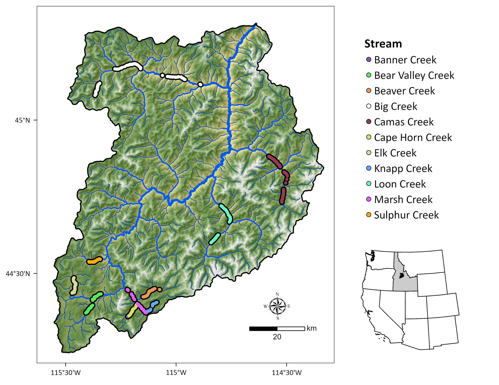
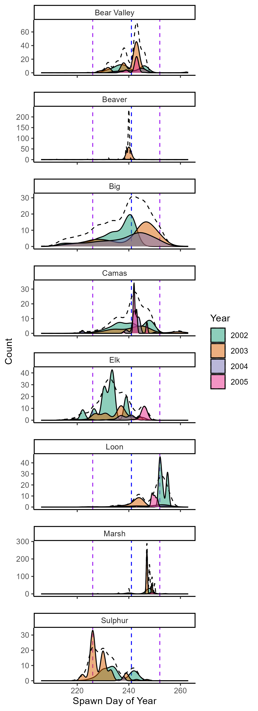
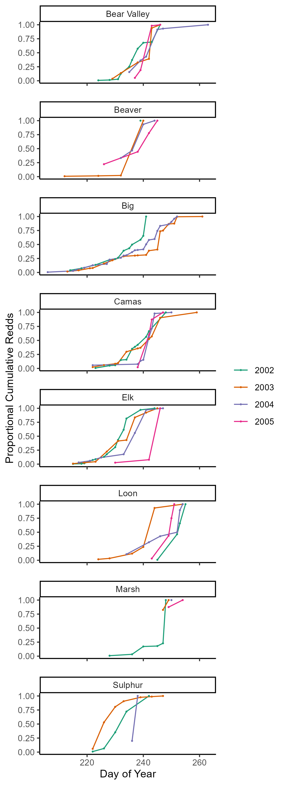

```{r, echo=FALSE}
knitr::opts_chunk$set(echo = FALSE, 
                      message = FALSE,
                      warning = FALSE)
```

## Methods

In this paper, we examine how stream geomorphic attributes, water temperature profiles, habitat features, climatic factors, and spawning escapements influence wild Chinook salmon phenotypic diversity, specifically, the timing of spawning. We compare detailed salmon spawn timing data across four years in twelve stream reaches within six major watersheds, all within a relatively intact river basin in central Idaho.

### Study area

(Text below verbatim from Isaak and Thurow 2006)

This study was conducted in the Middle Fork of the Salmon River (MFSR) in central Idaho (Fig. 1). The MFSR drains 7330 km2 of forested and steeply mountainous terrain in central Idaho that ranges in elevation from 1000 to 3150 m. Most of the area (\>95%) is administered by the USDA Forest Service and was managed as a primitive area from 1930 to 1980 before receiving permanent protection as part of the Frank Church – River of No Return – Wilderness in 1980. As a result, road and trail densities are low and most areas exist in relatively pristine condition. Some areas continue to recover from the effects of grazing or mining, but cessation of many of these activities has occurred since wilderness designation and listing of Snake River salmon stocks under the Endangered Species Act. Natural disturbances from fires, hillslope movements, and floods persist, and these processes maintain a dynamic mosaic of landscape conditions.

\newpage

Figure 1. Map of the Middle Fork Salmon River (MFSR) study area showing redd locations (2002-2005) and stream reaches.

{height="75%"}

\newpage

### Spawn timing data

Spawn timing data for Chinook salmon were collected from 2002 to 2005 in the MFSR. DETAILS.

To describe variation in spawn timing, we used redd counts from XX stream reaches (Fig. 1) in the MFSR. Redd counts were conducted... Redds were counted by walking the stream and visually identifying redds. The number of redds was recorded for each stream reach and the date of the count was noted. The data were then compiled into a single dataset for analysis.

{height="70%"}

Figure 2. Temporal distribution of spawn timing for Chinook salmon in the MFSR. 2002-2005.

-   colors = year
-   x axis = day of year
-   y-axis = count of unique redds
-   dashed lines (black) = average spawning distribution by site across all years
-   vertical dotted lines (purple) = 5th and 95th quantile for ALL MFSR redds across years
-   vertical dotted line (blue): median (50th quantile) for ALL MFSR redds across years

\newpage

### Proportional cumulative redds

{height="70%"}

Figure 3. Proportional cumulative redds by stream.

-   color = year
-   x-axis = day of year
-   y-axis = Proportional cumulative redds

\newpage

### Models and model selection

Import data and combine:

```{r, message=FALSE}
library(tidyverse); library(here)
# Import data -------------------------------------------------------------

spawn_data <- read_csv(here("./data/russ_spawn/mfsr_spawn_cleaned.csv"))
flow_data <- read_csv(here("./data/spawn_flows.csv"))
comid_data <- readRDS(here("./data/elevslope.rds"))
load("~/Library/CloudStorage/Box-Box/Morgan.Sparks/Projects/mfsr_phenology/data/comid_temps.RData")

# Combine data ------------------------------------------------------------

# read in temperature data and reshape
temp_data <- out |> 
  filter(period == "before" & duration %in% c(30,60,90)) |> 
  pivot_wider(names_from = "duration", values_from = avg_temp, names_prefix = "temp_")

#commbine flow and spawn in combined data
combined_data  <- spawn_data |> 
  left_join(flow_data, join_by(date == spawn_date))

#add temperature data to combined data
combined_data  <- combined_data  |> 
  left_join(temp_data, join_by( UNIQUE_ID == redd_id))

# add physical data to combined data and then filter 
combined_data  <- combined_data  |> 
  left_join(comid_data, join_by(COMID)) |> 
  mutate(mean_elevation = (MAXELEVSMO + MINELEVSMO)/2/100, # take avg elev. & convert to m
         yday = yday(date)) |> # make DOY
  filter( stream != "Knapp" & stream != "Cape Horn" & year != 2001) # filter out bad sites and years

# make a df of just response and covariates
model_data <- combined_data |> 
  select(yday, stream, year,
         flow_30, flow_60,flow_90,
         temp_30, temp_60, temp_90,
         SLOPE, mean_elevation)

model_data$year <- as.factor(model_data$year)


```

Now we check for colinearity between covariates (expect temp and flow to be bad). Remove covariates with corr \>= 0.6.

```{r, message=FALSE}
model_data |> 
  select(-yday) |> 
GGally::ggpairs()
```

If we look at the above figure we see temperature and flow at the 30, 60, and 90 day intervals are colinear with one another within the larger covariate (temp or flow). So we need to choose our best predictive variable from that set (though note corr of temp_30 and temp_90 are \<0.6, barely).

We also see high correlation between temp_90 and the different flow metrics. So we will look to see which temp metric to choose and make decisions about which flow metrics to include after.

```{r}
# temp models
lm_30 <- lm(yday ~ temp_30, data = model_data)
lm_60 <- lm(yday ~ temp_60, data = model_data)
lm_90 <- lm(yday ~ temp_90, data = model_data)

AIC(lm_30, lm_60, lm_90)

#sjPlot::tab_model(lm_30, lm_60, lm_90)
```

We can see the model with 90 days of temperature before spawning is much better than the other models (delta AIC = 1734.69)

Let's look at correlation again when removing temp_60 and temp_30.

```{r}
model_data |> 
  select(-yday, -temp_30, -temp_60) |> 
GGally::ggpairs()
```

So now we see that flow_30 and flow_60 are highly correlated with temp_90 so we need to also remove those.

Our final model coviates then will be temp_90, slope, elevation, year, site, and abundance (once added).

```{r}
# standardize function
scale2 <- function(x, na.rm = FALSE) (x - mean(x, na.rm = na.rm)) / sd(x, na.rm)

# standardize continuous covariates
model_data_final <- model_data |> 
  select(yday, 
         stream, 
         year,
         flow_90,
         temp_90,
         SLOPE, 
         mean_elevation) |> 
  mutate(across(c("flow_90", "temp_90", "mean_elevation", "SLOPE"), scale2))

full_model <- lm(yday ~
                   stream +
                   year +
                   flow_90 +
                   temp_90 +
                   SLOPE +
                   mean_elevation, 
                 data = model_data_final)


int_model <- lm(yday ~
                   year +
                   flow_90 +
                   temp_90 * stream +
                   SLOPE +
                   mean_elevation, 
                 data = model_data_final)

intercept_model <- lm(yday ~
                   1, 
                 data = model_data_final)

AIC(full_model, int_model, intercept_model)


```

From AIC selection we see that the interaction model preforms the best by far. We can look at the model output below.

```{r}
summary(int_model)
#sjPlot::tab_model(int_model)
```

R\^2 =0.923!
